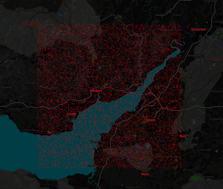
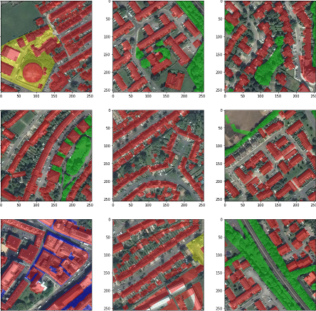
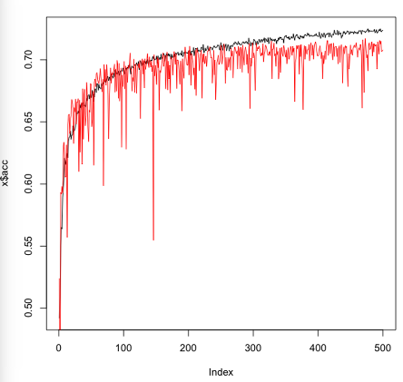
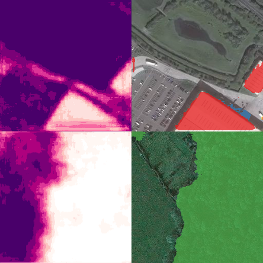
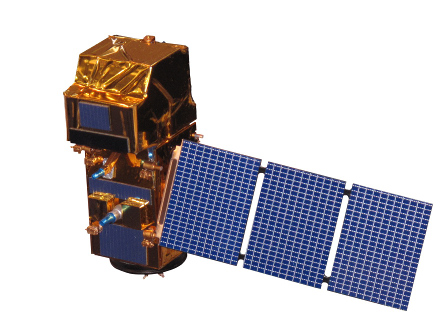
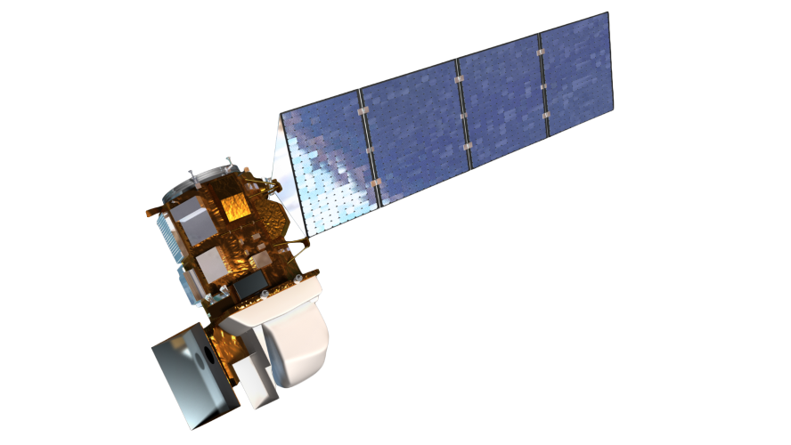
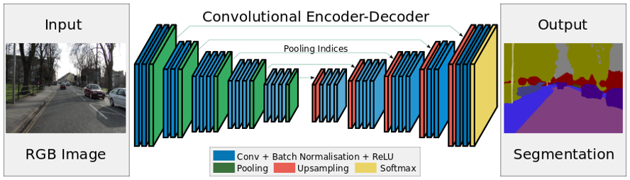

# Skywalker 

> Experiments with satellite image data.


## Synopsis

The goal of *project skywalker* is to research potential sources of satellite
image data and to implement various algorithms for satellite image 
classification, object detection and segmentation.

Skywalker is a precursor for a production ready, *end-to-end* satellite image
processing framework and also is intended to serve as a protyping environment
for testing recent and future developments.

**Note that this project is intended to form a starting point for future research**

## Table of contents

* [Goals](#goals)
* [Running the code](#running-the-code)
  * [Creating a training dataset](#creating-a-training-dataset)
  * [The model](#the-model)
    * [Training](#training)
    * [Validating](#validating)
    * [Running](#running)
  * [Further work](#further-work)
* [Background research](#background-research)
  * [Satellite themes of interest](#satellite-themes-of-interest)
    * [Earth Observation](#earth-observation)
    * [Object detection](#object-detection)
  * [Computer vision themes of interest](#computer-vision-themes-of-interest)
  * [Data sources](#data-sources)
    * [Raw image data](#raw-image-data)
      * [Sentinel-2 (ESA)](#sentinel-2-esa)
      * [Landsat-8 (NASA)]](#landsat-8-nasa)
      * [Links](#links)
      * [Papers](#papers)
      * [Other](#other)
    * [Pre-labeled image data](#pre-labeled-image-data)
    * [Object and land-use labels](#object-and-land-use-labels)
  * [Modeling](#modeling)
    * [Modeling papers](#modeling-papers)
      * [Satelite specific](#satelite-specific)
      * [Modeling specific](#modeling-specific)
    * [Model implementations](#model-implementations)
    * [Image segmentation model implementations](#image-segmentation-model-implementations)
      * [General](#general)
      * [SegNet](#segnet)
      * [U-Net](#u-net)
      * [DeepLab](#deeplab)
      * [Dialated convolutions](#dilated-convolutions)
      * [PSPNet (Pyramid Scene Parsing Network)](#pspnet-pyramid-scene-parsing-network)
  * [Comeptitive data science](#comeptitive-data-science)
  * [Tools and utilities](#Tools-and-utilities)
  * [Visualisations and existing tools](#visualisations-and-existing-tools)
  * [Projects using Sentinel data](#projects-using-sentinel-data)
  * [Blogs](#blogs)

## Goals

1. Review potential sources of satellite imagery
2. Implement an existing satellite segmentation algorithm
3. Document and communicate the algorithm
4. Define the high level pipeline
5. Develop and test a model for collaborative project work

Please consult the [success criteria](success_criteria.md) for a detailed 
breakdown of this project's goals.


# Running the code

The following steps describe the end-to-end flow for the current work in 
progress. The implementation makes use of a utility to help build a training
dataset, and a SegNet encoder/decoder network for image segmentation.


## Creating a training dataset

Install some os deps:
```
brew install mapnik
brew install paralell
```

Clone and install the skynet-data project:

```
git clone https://github.com/developmentseed/skynet-data
cd skynet-data
```

The [skynet-data](https://github.com/developmentseed/skynet-data) project is a
tool for sampling [OSM QA tiles](https://osmlab.github.io/osm-qa-tiles/) and
associated satelite image tiles from [MapBox](https://www.mapbox.com/maps/satellite/).

The first task is to decide what classes to include in the dataset. These are 
specified in a JSON configuration file and follow the osm tag format. This 
project attempts to identify **6** types of land use and objects:

* [residential](http://wiki.openstreetmap.org/wiki/Tag:landuse%3Dresidential)
* [commercial](http://wiki.openstreetmap.org/wiki/Tag:landuse%3Dcommercial)
* [industrial](http://wiki.openstreetmap.org/wiki/Tag:landuse%3Dindustrial)
* [vegetation](http://wiki.openstreetmap.org/wiki/Tag:landuse%3Dgrass) (A hierarchical filter including woodland, trees, scrub, grass etc.)
* [buildings](http://wiki.openstreetmap.org/wiki/Key:building) Note the extensive list of building types.
* [brownfield](http://wiki.openstreetmap.org/wiki/Tag:landuse%3Dbrownfield)

`cd` into `classes` and create a new configuration `mine.json`:

```json
[{
  "name": "residential",
  "color": "#010101",
  "stroke-width": "1",
  "filter": "[landuse] = 'residential'",
  "sourceLayer": "osm"
}, {
  "name": "commercial",
  "color": "#020202",
  "stroke-width": "1",
  "filter": "[landuse] = 'commercial'",
  "sourceLayer": "osm"
}, {
  "name": "industrial",
  "color": "#030303",
  "stroke-width": "1",
  "filter": "[landuse] = 'industrial'",
  "sourceLayer": "osm"
}, {
  "name": "vegetation",
  "color": "#040404",
  "stroke-width": "1",
  "filter": "([natural] = 'wood') or 
             ([landuse] = 'forest') or 
             ([landuse] = 'tree_row') or 
             ([landuse] = 'tree') or 
             ([landuse] = 'scrub') or 
             ([landuse] = 'heath') or 
             ([landuse] = 'grassland') or 
             ([landuse] = 'orchard') or 
             ([landuse] = 'farmland') or 
             ([landuse] = 'tree') or 
             ([landuse] = 'allotments') or 
             ([surface] = 'grass') or 
             ([landuse] = 'meadow') or 
             ([landuse] = 'vineyard')",
  "sourceLayer": "osm"
},
{
  "name": "building",
  "color": "#050505",
  "stroke-width": "1",
  "filter": "[building].match('.+')",
  "sourceLayer": "osm"
},
{
  "name": "brownfield",
  "color": "#060606",
  "stroke-width": "1",
  "filter": "[landuse] = 'brownfield'",
  "sourceLayer": "osm"
}]
```

The skynet-data tool will use this configuration to create ground-truth labels
for the specified classes. For each satelite image instance, it's pixel-by-pixel
ground-truth will be encoded as an image with the same size as the satelite
image. An individual class will be encoded by colour, such that a specific pixel
belonging to an individual class will assume one of **7** colour values 
corresponding to the above configuration.

For example, a pixel belonging to the **vegetation** class will assume the RGB
colour `#040404` and a building will assume the value `#050505`. Note that these
can be any RGB colour. For convenience, I have chosen to encode the class number
in each of the 3 RGB bytes so that it can be easily retrieved later on without
the need for a lookup table.

Note that it is possible for a pixel to assume an **unknown** class in which
case, it can be considered as "background". Thus Unknown pixels have been 
encoded as `#000000` (the 7th class).

Next, in the `skynet-data` parent directory, add the following to the 
`Makefile`:

```
QA_TILES?=united_kingdom
BBOX?='-3.3843,51.2437,-2.3923,51.848'
IMAGE_TILES?="tilejson+https://a.tiles.mapbox.com/v4/mapbox.satellite.json?access_token=$(MapboxAccessToken)"
TRAIN_SIZE?=10000
CLASSES?=classes/mine.json
ZOOM_LEVEL?=17
```

This will instruct the proceeding steps to download 10,000 images from within a
bounding box (defined as part of the South-west here). The images will be 
randomly sampled within the bounding box area. Zoom level 17 corresponds to 
approx. 1m per pixel resolution. To specify the bounding box area, 
[this tool](https://tools.geofabrik.de/calc/) is quite handy. Note that 
coordinates are specified in the following form:

```
-lon, -lat, +lon, +lat
```

Before following the next steps, go to [MapBox](https://www.mapbox.com/) and 
sign up for a developer key.


Having obtained your developer key from MapBox, store it in an env. variable:

```
export MapboxAccessToken="my_secret_token"
```

Then initiate the download process:

```
make clean
rm -f data/all_tiles.txt
make download-osm-tiles
make data/all_tiles.txt
make data/sample.txt
make data/labels/color
make data/images
```

You will end up with 10,000 images in `data/images` and 10,000 "ground truth"
images in `data/labels`. `data/sample-filtered.txt` contains a list of files of
which **at least 1 pixel** belongs to a specified class.



Note, that there is in a convenience tool in the skynet-data utility for quickly
viewing the downloaded data. To use it, first install a local webserver, e.g.,
[Nginx](https://www.nginx.com/) and add an alias to the `preview.html` file. You
can then visualise the sampled tiles by following a URL of the following form:

`http://localhost:8080/preview.html?accessToken=MAPBOX_KEY&prefix=data`

See [notebooks](notebooks/) for a visual inspection of some of the data. The 
following shows some of the downloaded tiles with overlaid OSM labels:



The level of detail can be quite fine in places, while in others, quite sparse.
This example shows a mix of industrial (yellow) and commercial (blue) land areas
mixed in with buildings (red) and vegetation (green).

## The model

The model implemented here is the [SegNet](http://mi.eng.cam.ac.uk/projects/segnet/) 
encoder/decoder architecture. There are 2 variations of this architecure, of
which the simplified version has been implemented here.
See [paper](http://arxiv.org/abs/1511.00561) for details. Briefly, the 
architecture is suited for multi-class pixel-by-pixel segmentation and has been
shown to be effective in scene understanding tasks. Given this. it **may** also
be suited to segmentation of satelite imagery.

Side note: The architecutre has been shown to be very effective at segmenting 
images from car dashboard cameras, and is of immediate interest in our street
-view related research.

The model, specified in [model.py](model.py), consists of 2 main components.
The first is an **encoder** which takes as input a 256x256 RGB image and 
compresses the image into a set of features. In fact, this component is the 
same as a [VGG16](http://www.robots.ox.ac.uk/~vgg/research/very_deep/) network
without the final fully connected layer. In place of the final fully connected
layer, the encoder is connected to a decoder. This decoder is a reverse image
of the encoder, and acts to up-sample the features.

The final output of the model is a N\*p matrix, where p = 256\*256 corresponding
to the original number of image pixels and N = the number of segment classes. As
such, each pixel has an associated class probability vector. The predicted 
segment/class can be extrcacted by taking the the max of these values.


### Training

First install `numpy`, `theano`, `keras` and `opencv2` Then:

```
python3 train.py
```

[train.py](train.py) will use the training data created with skynet in the 
previous step. Note that by default, train.py expects to find this data in
`../skynet-data/data`. Having loaded the raw training data and associated
segment labels into a numpy array, the data are stored in
[HDF5](https://en.wikipedia.org/wiki/Hierarchical_Data_Format) format in
`data/training.hdf5`. On subsequent runs, the [data loader](data.py) will first
look for this HDF5 data as to reduce the startup time. Note that the 
`data/training.hdf5` can be used by other models/frameworks/languages.

In current form, all parameters are hard-coded. These are the default 
parameters:

| Parameter      | Default | Note                                              |
| -------------- | ------- | ------------------------------------------------- |
| validation     | 0.2     | % of dataset to use as training validation subset |
| epochs         ! 10      | number of training epochs                         |
| learning\_rate | 0.001   | learning rate                                     |
| momentum       | 0.9     | momentum                                          |


As-is, the model converges at a slow rate:



Training and validation errors (loss and accuracy) are stored in
`training_log.csv`. On completion, the network weights are dumped into 
`weights.hdf5` - Note that this may be loaded into the same model implemented in
another language/framework.

### Validating

Having trained the model, validate it using the testing data held back in the
data-preparation stage:

```
python3 validate.py
```

[validate.py](validate.py) expects to find the trained model weights in 
weights.hdf5 in the current working directory. In addition to printing out the
validation results, the pixel-by-pixel class probabilities for each instance
are stored in `predictions.hdf5` which can be inspected to debug the model.

### Running 

[feed\_forward.py](feed_forward.py) takes as input trained weights, an input 
image and an output directory to produce pixel-by-pixel class predictions.

```
python3 feed_forward.py <hdf5 weights>  <output dir>
```

Specifically, given an input satellite image, the script outputs the number of
pixels belonging to one the 8 land-use classes, such that the sum of class 
pixels = total number of pixels in the image. In addition, the script will 
output *class heatmaps* and *class segments* visualisations in to the 
`<output dir>`. 



The class heatmaps (1 image per class) show the model's confidence that a pixel
belongs to a particular class (buildings and vegetation shown above). Given this
confidence, the maximum value from each class is used to determine the final 
pixel segment, shown on the right in the above image. Some more visualisations
can be found in [this notebook](notebooks/visualise_predictions.ipynb).

## Further work/notes 

* The model as-is, is quite poor, trained to only 70% accuracy over the validation set).
* The model has only been trained once: fine-tuning and hyperparameter search has not yet been completed.
* The training data is very noisy: the segments are only partially labelled. As such, missing labels are assigned as "background".
* General issues/bugs/improvements can be found on the [project board](skywalker/projects/1).

# Background research

## Satellite themes of interest

In general, satellite image processing themes can be categorised into two main
themes:


### Earth Observation (EO)

The field of [Earth observation](https://en.wikipedia.org/wiki/Earth_observation)
is concerned with monitoring the status of the planet with various *sensors*, 
which includes, but is not limited to, the use of satellite data for monitoring
large areas of the earth's surface at regular, frequent intervals.

EO is a broad area, which may cover water management, forestry, agriculture,
urban fabric and land-use/cover in general.

A good example of EO is the use of the [normalised difference vegetation index (NDVI)](https://en.wikipedia.org/wiki/Normalized_difference_vegetation_index)
for monitoring nationwide vegetation levels. 

This sub-field does not depend on very high resolution data since it is mainly
concerned with quantifying some aspect of very large areas of land.


### Object detection

In contrast to EO, the field of object detection from satellite data is 
principally concerned with the localisation of specific objects as opposed to 
general land-use cover. 

A good example of Object detection from satellite data is 
[counting cars in carparks](https://medium.com/the-downlinq/car-localization-and-counting-with-overhead-imagery-an-interactive-exploration-9d5a029a596b)
from which various indicators can be derived, depending on the context. For 
example, it would be possible to derive some form of consumer/retail indicator
by periodically counting cars in super market car parks.

This sub-field will depend on very high resolution data depending on the 
application.


## Computer vision themes of interest

In addition to the two main satellite image processing themes of interest (EO
and object detection), there are four more general image processing sub-fields
which may be applicable to a problem domain. From "easiest" to most difficult:

1. **Classification**. At the lowest level, the task is to identify which 
objects are present in a scene. If there are many objects, the output may be an
ordered list sorted by amount or likelyhood of the object being present in the
scene. The classification may also extend beyond objects to abstract concepts
such as aesthetic value.

2. **Detection**. The next level involves localisation of the entities/concepts
in the scene. Typically this will include a bounding-box around identified 
objects, and/or object centroids.

3. **Segmentation**. This level extends classification and detection to include
pixel-by-pixel class labeling. Each pixel in the scene must be labeled with a
particular class, such that the entire scene can be described. Segmentation is
particularly appropriate for land-use cover. In addition, segmentaiton may be
extended to provide a form of augmented bounding-box: pixels outside of the 
bounding box area can be negatively weighted, pixels on the border +1 and pixels
inside the region [0, 1] inversely proportionate to the distance form the 
bounding box perimeter.

4. **Instance segmentation**. Perhaps the most challenging theme: In addition to
pixel-by-pixel segmentation, provide a segmented object hierarchy, such that 
objects/areas belonging to the same class may be individually segmented. E.g.,
segments for cars *and* car models. Commercial area, office within a commercial
area, roof-top belonging to a shop etc. 

The initial version of this project focuses on **option 3**: image segmentation
in the domain of **both** Earth Observation and object detection.


## Data sources

There are three types of data of interest for this project.

1. **Raw image data**. There are numerous sources for satellite image data, 
ranging from lower resolution (open) data most suited for EO applications, 
through to high resolution (mostly propitiatory) data-sets. 

2. **Pre-labeled image data**. For training an image classificiation, object
detection or image segmentation supervised learning model, it is necessary to
obtain ample training instances along with associated ground truth labels. In
the domain of general image classification, there exist plenty of datasets which
are mainly used to benchmark various algorithms.

3. **Image labels**. It will later be required to create training datasets with
arbitrary labeled instances. For this reason, a source of ground-truth and/or a
set of tools to facilitate image labeling and manual image segmentation will be
necessary.


### Raw image data 

This project (to date) focuses specifically on **open data**. The 2 main data
sources for EO grade images come from the 
[Sentinel-2](https://en.wikipedia.org/wiki/Sentinel-2) and
[Landsat-8](https://en.wikipedia.org/wiki/Landsat_8) satellites. Both satellites
host a payload of multi-spectrum imaging equipment.


#### Sentinel 2 (ESA)

The Sentinel-2 satellite is capable of sensing the following wavelengths:

| Band                     | Wavelength (&mu;m) | Resolution (m) |
| ------------------------ | ------------------ | -------------- |
| 01 – Coastal aerosol     | 0.443              | 60             |
| 02 – Blue                | 0.490              | 10             |
| 03 – Green	           | 0.560              | 10             |
| 04 – Red                 | 0.665              | 10             |
| 05 – Vegetation Red Edge | 0.705              | 20             |
| 06 – Vegetation Red Edge | 0.740              | 20             |
| 07 – Vegetation Red Edge | 0.783              | 20             |
| 08 – NIR                 | 0.842              | 10             |
| 8A – Narrow NIR	   | 0.865              | 20             |
| 09 – Water vapour        | 0.945              | 60             |
| 10 – SWIR – Cirrus       | 1.375              | 60             |
| 11 – SWIR                | 1.610              | 20             |
| 12 – SWIR                | 2.190              | 20             |



The visible spectrum captured by Sentinel-2 is the highest (open) data 
resolution available: 10 metres per pixel. Observations are frequent: Every 5
days for the same viewing angle.


#### Landsat-8 (NASA)

The Landsat-8 satellite is limited to 30m resolution accross all wavelengths
with the exception of it's panchromatic sensor, which is capable of capturing
15m per pixel data. The revisit frequency for landsat is 16 days.

| Band                           | Wavelength (&mu;m) | Resolution (m) |
| ------------------------------ | ------------------ | -------------- |
| 01 - Coastal / Aerosol         | 0.433 – 0.453      |	30             |
| 02 - Blue                      | 0.450 – 0.515      | 30             |
| 03 - Green                     | 0.525 – 0.600      | 30             |
| 04 - Red                       | 0.630 – 0.680      | 30             |
| 05 - Near Infrared             | 0.845 – 0.885      | 30             |
| 06 - Short Wavelength Infrared | 1.560 – 1.660      | 30             |
| 07 - Short Wavelength Infrared | 2.100 – 2.300      | 30             |
| 08 - Panchromatic              | 0.500 – 0.680      | 15             |
| 09 - Cirrus                    | 1.360 – 1.390      | 30             |





#### Links 

* [sentinel-playground](http://apps.sentinel-hub.com/sentinel-playground/?source=S2&lat=51.653814904471545&lng=-3.021240234375&zoom=8&preset=2_COLOR_INFRARED__VEGETATION_&layers=B04,B03,B02&maxcc=20&gain=1.0&gamma=1.0&time=2015-01-01%7C2017-12-05&atmFilter=&showDates=false) - This is a nice demo showing the available sentinel-2 bands.

* [Copernicus Open Access Hub](https://scihub.copernicus.eu/) - The Copernicus Open Access Hub (previously known as Sentinels Scientific Data Hub) provides complete, free and open access to [Sentinel-1](https://sentinel.esa.int/web/sentinel/missions/sentinel-1), [Sentinel-2](https://sentinel.esa.int/web/sentinel/missions/sentinel-2) and [Sentinel-3](https://sentinel.esa.int/web/sentinel/missions/sentinel-3).

* [Satellite Applications Catapult - Data discovery hub](http://data.satapps.org/) - Very nice. Lists pretty much everything.

* [Satellite Applications Catapult - Sentinel Data Access Service (SEDAS)](https://sa.catapult.org.uk/facilities/sedas/]) - (API) portal enabling end-users to search and download data from Sentinel 1 & 2 satellites. It aims to lower barriers to entry and create the foundations for an integrated approach to satellite data access.

* [Google](https://developers.google.com/maps/documentation/static-maps/) - 25k per day... :) - would also be easy to build testing tool from this.. Note that this data is &lt; 1m resolution, so perfectly suitable for object detection.

* [Earth on AWS](https://aws.amazon.com/earth/) - Lots of data sources (inc. sentinel and landsat) + platform for large-scale processing.


#### Papers

* [Suitability of Sentinel-2 Data for Tree Species Classification in Central Europe](https://www.researchgate.net/profile/Markus_Immitzer/publication/303374163_Suitability_of_Sentinel-2_Data_for_Tree_Species_Classification_in_Central_Europe/links/573f0bbd08aea45ee844f238/Suitability-of-Sentinel-2-Data-for-Tree-Species-Classification-in-Central-Europe.pdf)


#### Other

* [Terrapattern](http://www.terrapattern.com/about) - alpha version of Terrapattern: "similar-image search" for satellite photos. They use a ResNet. This is truely awesome.

* [TEP Urban platform - Thematic Apps](https://urban-tep.eo.esa.int/#!thematic) - Lots of things. [Urban density](https://urban-tep.eo.esa.int/geobrowser/?id=guf#!&context=GUFDensity%2FGUF-DenS2012) / GUF. Derived from sat data.

* [Github satellite-imagery view](https://github.com/topics/satellite-imagery) - Good starting point.

* [Awesome Sentinel - Github](https://github.com/Fernerkundung/awesome-sentinel) - Sat data tools/utils/visualisations etc.


### Pre-labeled image data

There are numerous sources of pre-labeled image data available. Recently, there
have been a number of satellite image related competitions hosted on Kaggle and
TopCoder. This data may be useful to augment an existing dataset, to pre-train
models or to train a model for later use in an ensemble.

* [DSTL - Kaggle](https://www.kaggle.com/c/dstl-satellite-imagery-feature-detection)

* [Draper Satellite Image Chronology - Kaggle](https://www.kaggle.com/c/draper-satellite-image-chronology)

* [Understanding the Amazon from Space - Kaggle](https://www.kaggle.com/c/planet-understanding-the-amazon-from-space)

* [Ships in Satellite Imagery - Kaggle](https://www.kaggle.com/rhammell/ships-in-satellite-imagery) - From [Open California](https://www.planet.com/products/open-california/) dataset.

* [2D Semantic Labeling - Vaihingen data](http://www2.isprs.org/commissions/comm3/wg4/2d-sem-label-vaihingen.html) - This is from a true orthophotographic survey (from a plane). The data is 9cm resolution!

* [SAT-4 and SAT-6 airborne datasets](http://csc.lsu.edu/~saikat/deepsat/) - Very high res (1m) whole of US. 65 Terabytes. (DeepSat) 1m/px. (2015). SAT-4: barren land, trees, grassland, other. SAT-6: barren land, trees, grassland, roads, buildings, water bodies. (RGB + NIR) 


### Object and land-use labels

There exist a number of land-use and land-cover datasets. The main issue is 
dataset age: If the objective is to identify construction sites or urban sprawl
then a dataset &gt; 1 year is next to useless, unless it can be matched to 
imagery from the same time period which would then only be useful for the 
creation of a training dataset.

The most promising source (imo) is the [OpenStreetMap](https://www.openstreetmap.org/)
project since it is updated constantly and contains an **extensive** hierarchy
of relational objects. There is also the possibility to contribute back to the 
OMS project should manual labeling be necessary.

* [UC Merced Land Use Dataset](http://vision.ucmerced.edu/datasets/landuse.html) - 2100 256x256, 1m/px aerial RGB images over 21 land use classes. US specific. (2010)

* [Open street map landuse](http://osmlanduse.org/#11/-3.23866/51.57133/0/) - OSM landuse visualised in this tool. Some studies have used this in combo. with google sat. images.

* [European Environment Agency - Urban Atlas](https://www.eea.europa.eu/data-and-maps/data/urban-atlas) - Land cover data for Large Urban Zones with more than 100.000 inhabitants.


## Modeling

The proof of concept in this project makes use of concepts from deep 
learning. A review of the current state of the art, covering papers, articles,
competitive data science platform results and open source projects indicates 
that the most recent advances have been in the area of image segmentation - most
likely fueled by research trends in autonomous driving..

From the image segmentation domain, the top performing, most recent developments
tend to be some form of encoder/decoder neural network in which the outputs of a
standard CNN topology (E.g., VGG16) are upsampled to form class probability 
matrices with the same dimensions as the original input image.

The following papers and resources provide a good overview of the field.

### Modeling Papers

#### Satelite specific

##### 2017

* [Urban environments from satellite imagery - Github](https://github.com/adrianalbert/urban-environments) - Comparing urban environments using satellite imagery and convolutional neural nets. This is a very nice paper - lots of references to datasets. The focus is on open data. They use google maps api + [Urban Atlas](https://www.eea.europa.eu/data-and-maps/data/urban-atlas) for ground truth. Note: Urban Atlas last updated in 2010. They do not do pixel-wise classification, instead predict the classes inside the tile.

* [Deep Learning Based Large-Scale Automatic Satellite Crosswalk Classification](https://arxiv.org/pdf/1706.09302.pdf) - Zebra crossing identification using Google sat image data + Open street map zebra crossing locations. Associated code [here](https://github.com/rodrigoberriel/satellite-crosswalk-classification).

* [Learning Aerial Image Segmentation from Online Maps](https://arxiv.org/pdf/1707.06879.pdf)

##### 2016

* [Classification and Segmentation of Satellite Orthoimagery Using Convolutional Neural Networks](https://ai2-s2-pdfs.s3.amazonaws.com/6269/c25f3cebe4dba83bd7feb78735796ffcdf6d.pdf) - Per pixel classification of vegetation, ground, roads, buildings and water. Per pixel is done in a sliding window: the pixel to be classified is the centre pixel of the window. The window has a number of dimensions (typically r, g, b) correspsonding to the wavelengths available from the satellite. Eg., may have an extra channel for near infrared. Standard CNN used: stacked conv-layers, fc layer and finally a softmax classifiier. ReLUs have been used in conv-layer. The fc layer used here is actually a 1000 hidden unit denoising auto-encoder. Has a post processing step: pixel-by-pixel classifications are likely to involve noise - e.g., a single pixel classified as an industrial area in the middle of a field/ "salt and pepper misclassifications" SLIC and other averaging has been used here. Interestingly, paper mentions using DBSCAN - a form of density clustering to solve this.

* [Semantic Segmentation of Small Objects and Modeling of Uncertainty in Urban Remote Sensing Images Using Deep Convolutional Neural Networks](https://www.cv-foundation.org/openaccess/content_cvpr_2016_workshops/w19/papers/Kampffmeyer_Semantic_Segmentation_of_CVPR_2016_paper.pdf) - Uses 9cm ultra high res. data from ISPRS. They use the common F1 score to eval results.

* [First Experience with Sentinel-2 Data for Crop and Tree Species Classifications in Central Europe](http://www.mdpi.com/2072-4292/8/3/166/htm) - Random Forests.

* [A Direct and Fast Methodology for Ship Recognition in Sentinel-2 Multispectral Imagery](http://www.mdpi.com/2072-4292/8/12/1033/htm)

* [Benchmarking Deep Learning Frameworks for the Classification of Very High Resolution Satellite Multispectral Data](https://www.isprs-ann-photogramm-remote-sens-spatial-inf-sci.net/III-7/83/2016/isprs-annals-III-7-83-2016.pdf) - uses the [SAT-4 and SAT-6 airborne datasets](http://csc.lsu.edu/~saikat/deepsat/).

* [Forecasting Vegetation Health at High Spatial Resolution - Github](https://github.com/JohnNay/forecastVeg) - Tool to produce short-term forecasts of vegetation health at high spatial resolution, using open source software and NASA satellite data that are global in coverage.

* [Automatic Building Extraction in Aerial Scenes Using Convolutional Networks](https://arxiv.org/pdf/1602.06564v1.pdf) - Describes a nice labelling technique: "Signed Distance Transform". +ve inside region, 0 at boundary and -ve outside. As described [here](https://medium.com/the-downlinq/getting-started-with-spacenet-data-827fd2ec9f53).

##### 2015

* [Marker-Controlled Watershed-Based Segmentation of Multiresolution Remote Sensing Images](https://s3.amazonaws.com/academia.edu.documents/45383993/Marker-Controlled_Watershed-Based_Segmen20160505-26355-1xvg3iz.pdf)

* [Stable Mean-Shift Algorithm and Its Application to the Segmentation of Arbitrarily Large Remote Sensing Images](http://faculty.wwu.edu/wallin/envr442/pdf_files/Michel_etal_2015_Stable_mean_shift_algorithm_app_to_segmentation_large_remote_sensing_images_IEEE_Trans_Geosci_RS.pdf)

* [Satellite Image Segmentation based on YCbCr Color Space](http://www.indjst.org/index.php/indjst/article/viewFile/51281/46256)

* [Unsupervised Deep Feature Extraction for Remote Sensing Image Classification](https://arxiv.org/pdf/1511.08131.pdf)

##### 2014

* [Remote Sensing Image Segmentation by Combining Spectral and Texture Features](http://web.cse.ohio-state.edu/~wang.77/papers/YWL.tgrs14.pdf)

##### 2013

* [Geographic Object-Based Image Analysis – Towards a new paradigm](http://www.sciencedirect.com/science/article/pii/S0924271613002220)

* [Hyperspectral Remote Sensing Data Analysis and Future Challenges](https://pdfs.semanticscholar.org/4c97/98a76945dc2651feebfe0a2e35ae31abe64f.pdf)

#### Modeling specific

##### 2017

* [review on deep learning methods for semantic segmentation](https://arxiv.org/pdf/1704.06857.pdf)

* [SegNet: A Deep Convolutional Encoder-Decoder Architecture for Image Segmentation](http://ieeexplore.ieee.org/stamp/stamp.jsp?arnumber=7803544)

* [Pyramid Scene Parsing Network](https://arxiv.org/pdf/1612.01105.pdf). Bleeding edge.

##### 2016

* [DeepLab: Semantic Image Segmentation with Deep Convolutional Nets, Atrous Convolution, and Fully Connected CRFs](https://arxiv.org/pdf/1606.00915.pdf)

##### 2015

* [Fully Convolutional Networks for Semantic Segmentation](https://people.eecs.berkeley.edu/~jonlong/long_shelhamer_fcn.pdf) - \*\*\*

* [U-Net: Convolutional Networks for Biomedical Image Segmentation](https://arxiv.org/pdf/1505.04597.pdf) - Used for 2nd place in DSTL challenge.


### Model implementations

There exist a number of implementations of recent satelite image procesing 
techniques. The following Github respositories are a good research starting
point:

* [Github - DeepOSM](https://github.com/trailbehind/DeepOSM) - \*\*\* Train a deep learning net with OpenStreetMap features and satellite imagery.. Data is combo of osm classifications + [NAIP data](https://www.fsa.usda.gov/programs-and-services/aerial-photography/imagery-programs/naip-imagery/) (National Agriculture Imagery Program) / us specific. TensorFlow. Predict if the center 9px of a 64px tile contains road.

* [Github - Deep networks for Earth Observation](https://github.com/nshaud/DeepNetsForEO) - Pretrained [Caffe](https://github.com/bvlc/caffe) [SegNet](https://arxiv.org/abs/1511.02680) models trained on [ISPRS Vaihingen](http://www2.isprs.org/commissions/comm3/wg4/2d-sem-label-vaihingen.html) dataset and [ISPRS Potsdam](http://www2.isprs.org/potsdam-2d-semantic-labeling.html) datasets. Uses OSM tiles. SegNet = all pixels. Note, there is also a probabilistic extension to segnet. SegNet has also been used with GSV imagery..

* [Github - Raster Vision](https://github.com/azavea/raster-vision) - Deep learning for aerial/satellite imagery. [ResNet50](https://arxiv.org/abs/1512.03385), [Inception v3](https://arxiv.org/abs/1512.00567), [DenseNet121](https://arxiv.org/abs/1608.06993), [DenseNet169](https://arxiv.org/abs/1608.06993) models. Uses [Keras](https://keras.io/) and [Tensorflow](https://www.tensorflow.org/).

* [Github - Deep Learning Tutorial for Kaggle Ultrasound Nerve Segmentation competition, using Keras](https://github.com/jocicmarko/ultrasound-nerve-segmentation) - This monster was used in 1tst place solution to DSTL Kaggle satellite challenge. (U-net)

* [Predicting Poverty and Developmental Statistics from Satellite Images using Multi-task Deep Learning - Github](https://github.com/agarwalt/satimage) - Keras, Google sat. images, India cencus data.

* [Using convolutional neural networks to pre-classify images for the humanitarian openstreetmap team (HOT & mapgive)](https://github.com/larsroemheld/OSM-HOT-ConvNet) - Donated MapGive data + Openstreetmap. Caffe, SegNet.

* [OSMDeepOD - OSM and Deep Learning based Object Detection from Aerial Imagery](https://github.com/geometalab/OSMDeepOD) - Object detection from aerial imagery using open data from OpenStreetMap. - Not sure where images come from. TensorFlow, pretrained Inception V3.

* [ssai-cnn - Semantic Segmentation for Aerial / Satellite Images with Convolutional Neural Networks](https://github.com/mitmul/ssai-cnn) - uses [Massachusetts road & building dataset](https://www.cs.toronto.edu/~vmnih/data/). Implementation of CNN, based on methods in this [paper](http://www.ingentaconnect.com/content/ist/jist/2016/00000060/00000001/art00003)

* [SpaceNetChallenge models - Github](https://github.com/SpaceNetChallenge/BuildingDetectors) - Winning solutions to spacenet building detection challenge.

1) [random forests](https://github.com/SpaceNetChallenge/BuildingDetectors/tree/master/wleite) Java :)

2) [Multi-scale context aggregation by dilated convolutions](https://github.com/SpaceNetChallenge/BuildingDetectors/tree/master/marek.cygan) (Tensorflow)

3) [Instance-aware semantic segmentation via multi- task network cascades](https://github.com/SpaceNetChallenge/BuildingDetectors/tree/master/qinhaifang) (Caffe)

4) [Fully Convolutional Network (FCN) + Gradient Boosting Decision Tree (GBDT)](https://github.com/SpaceNetChallenge/BuildingDetectors/tree/master/fugusuki) (Keras)

5) [FCN](https://github.com/SpaceNetChallenge/BuildingDetectors/tree/master/bic-user) (Keras)


### Image segmentation model implementations

#### General

* [Awesome Semantic Segmentation - Github](https://github.com/mrgloom/awesome-semantic-segmentation)

#### SegNet



Keras implementations:

(note these are all the basic version from the approach described in the [paper](http://arxiv.org/abs/1511.00561).

* [segnet](https://github.com/preddy5/segnet) 95 stars.
* [keras-segnet](https://github.com/imlab-uiip/keras-segnet) 65 stars.
* [SegNet-Basic])https://github.com/0bserver07/Keras-SegNet-Basic) 30 stars
* [image-segmentation-keras](https://github.com/divamgupta/image-segmentation-keras) 10 stars. Also some other's (u-net, fcn etc.)
* [keras-SegNet](https://github.com/ykamikawa/keras-SegNet) 1 star

#### U-Net

Keras implementations:

* [ultrasound-nerve-segmentation](https://github.com/jocicmarko/ultrasound-nerve-segmentation) 516 stars. From Kaggle.
* [another ultrasound-nerve-segmentation](https://github.com/EdwardTyantov/ultrasound-nerve-segmentation) 100 stars. Kaggle.
* [u-net](https://github.com/yihui-he/u-net) 90 stars.
* [ZF\_UNET\_224\_Pretrained\_Model](https://github.com/ZFTurbo/ZF_UNET_224_Pretrained_Model) 61 stars. \*\*\* used for 2nd place in DSTL challenge.
* [image-segmentation-keras](https://github.com/divamgupta/image-segmentation-keras) 10 stars. Same as above.
* [mobile-semantic-segmentation](https://github.com/akirasosa/mobile-semantic-segmentation) 6 stars.

#### DeepLab

Note, there seems to be no Keras implementation.
Tensorflow implementations:

* [tensorflow-deeplab-resnet](https://github.com/DrSleep/tensorflow-deeplab-resnet) 480 stars.

#### Dilated Convolutions

* [segmentation\_keras](https://github.com/nicolov/segmentation_keras) 153 stars.

#### PSPNet (Pyramid Scene Parsing Network)

Bleeding edge. More details [here](https://hszhao.github.io/projects/pspnet/index.html)

* [PSPNet-Keras-tensorflow](https://github.com/Vladkryvoruchko/PSPNet-Keras-tensorflow) 67 stars.


## Comeptitive data science

Lots of interesting reading and projects.

### DSTL - Kaggle

1. [U-Net](http://blog.kaggle.com/2017/04/26/dstl-satellite-imagery-competition-1st-place-winners-interview-kyle-lee/)

2. not known

3. [Another U-Net](http://blog.kaggle.com/2017/05/09/dstl-satellite-imagery-competition-3rd-place-winners-interview-vladimir-sergey/)

4. [modified U-Net](https://blog.deepsense.ai/deep-learning-for-satellite-imagery-via-image-segmentation/)

5. [pixel-wise logistic regression model](https://www.kaggle.com/lopuhin/full-pipeline-demo-poly-pixels-ml-poly)

### Understaning Amazon from space - Kaggle

1. [11 convolutional neural networks](http://blog.kaggle.com/2017/10/17/planet-understanding-the-amazon-from-space-1st-place-winners-interview/) - This is pretty nice, details winners' end-to-end architecture.


### Current competitions

* [13/11/17 - 28/02/18 SpaceNet challenge round 3](https://crowdsourcing.topcoder.com/spacenet) - TopCoder. Extract navigable road networks that represent roads from satellite images.


## Tools/utilities

* [SpaceNetChallenge utlitiles - Github](https://github.com/SpaceNetChallenge/utilities) - Packages intended to assist in the preprocessing of SpaceNet satellite imagery data corpus to a format that is consumable by machine learning algorithms.

* [Sentinelsat - Github](https://github.com/sentinelsat/sentinelsat) - Utility to search and download Copernicus Sentinel satellite images.

## Visualisations/existing tools

* [Global Forest Watch: An online, global, near-real time forest monitoring tool - Github](https://github.com/Vizzuality/gfw) - Really nice site. Also has an option to overlay Sentinel 2 images from specific dates.

## Projects using Sentinel data

* [sen2agri](http://www.esa-sen2agri.org/) - Preparing Sentinel-2 exploitation for agriculture monitoring. 2017 paper/demo: [Production of a national crop type map over the Czech Republic using Sentinel-1/2 images](http://www.esa-sen2agri.org/wp-content/uploads/docs/CzechAgri%20Final%20Report%201.2.pdf)


## Blogs

* [The DownLinQ](https://medium.com/the-downlinq) - Nice blog from CosmiQ.

* [2016: A review of deep learning models for semantic segmentation](http://nicolovaligi.com/deep-learning-models-semantic-segmentation.html)

* [2017: http://blog.qure.ai/notes/semantic-segmentation-deep-learning-review](http://blog.qure.ai/notes/semantic-segmentation-deep-learning-review)


## Other 

* [Satellite imagery - what can hospital carparks tell us about disease outbreak?](http://online.qmags.com/CMG0414/Default.aspx?pg=97&mode=2&imm_mid=0bb43a&cmp=em-strata-na-na-newsltr_20140423_elist#pg97&mode2)

